<div align="center">

<!-- Animated Typing Header -->
<a href="https://git.io/typing-svg"></a>

<!-- Bouncing Basketball -->
<br>

<br>

</div>

---

### 🔭 What I'm Working On

<table>
<tr>
<td>

```python
class Patricio:
    def __init__(self):
        self.role    = "Computer Engineering Student"
        self.focus   = ["AI", "Computer Vision", "Medical Tech"]
        self.hobbies = ["🏀 Basketball", "🏃 Running", "🌎 Culture"]
        self.motto   = "One landmark at a time."

    def current_project(self):
        return {
            "name": "detector-emergencia-ia",
            "tech": ["MediaPipe", "OpenCV", "DeepFace"],
            "goal": "Detect strokes & fainting in real-time"
        }
```

</td>
</tr>
</table>

> 🚀 **[detector-emergencia-ia](https://github.com/Elpatoteista/detector-emergencia-ia)** — A real-time Computer Vision system using MediaPipe and OpenCV to detect sudden medical emergencies through facial asymmetry and body posture analysis.

---

### 🛠 Tech Stack

<div align="center">


</div>

---

### 🌎 Languages & Beyond

| 🗣️ Languages | 🏀 Beyond the Code |
|---|---|
| 🇬🇧 English (B2/C1) | On the court — Playing basketball |
| 🇪🇸 Spanish (Native) | On the run — Chasing new personal bests |
| 🌍 Culture seeker | Always learning new perspectives |

---

<div align="center">

*"Building intelligent systems, one landmark at a time."* 📍

[](https://linkedin.com)
[](https://github.com/Elpatoteista)

</div>
